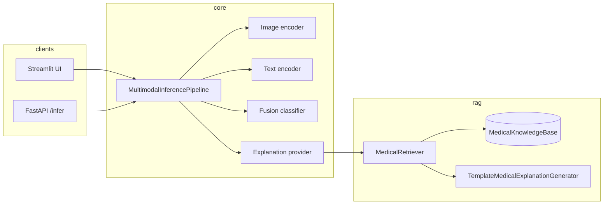

# Project overview

This document describes how the multimodal medical AI repository is structured, how data flows through inference and RAG, and where to extend behavior.

## Goals

1. **Multimodal inference**: Combine chest X-ray imaging and free-text clinical/symptom text into a single classification (e.g. normal vs pneumonia) with calibrated-style probabilities.
2. **Explainability**: Attach a **retrieval-augmented** narrative after the label is known, using a medical knowledge base and template (or pluggable) generation—not a substitute for clinical reasoning.
3. **Product-style surfaces**: A **REST API** for integration tests and clients, and a **Streamlit** demo that runs the same pipeline in-process and supports conversational follow-up grounded on the last prediction.
4. **Session continuity**: Persist recent chat and optional embedding-based “similar context” per session using **Redis**, with **no extra setup** when Redis is absent (in-memory backend).

## High-level architecture

**Session / chat storage** (Streamlit and `rag.chat_memory` / `rag.vector_store`) sits behind `rag.storage_backend.get_storage_backend()`:

- If `utils.redis_client.is_redis_available()` is true → **RedisBackend** (`chat:{session_id}`, `vec:{session_id}` JSON).
- Otherwise → **InMemoryBackend** (process-local, lost on restart).

Redis failures at runtime fall back to in-memory for that operation (logged).

## Backend (`backend/app`)

### Application entry

- `main.py` — builds FastAPI, CORS, mounts `api_v1_router` at `/api/v1`.
- `config.py` — **Settings** via `pydantic-settings`: env + `.env`, `extra="ignore"`. Hosts model import paths, checkpoint path, labels, RAG flags, Qdrant URL placeholders, logging.

### API layer

- `api/v1/routes/health.py` — liveness-style health.
- `api/v1/routes/infer.py` — validates input, maps to `MultimodalInput`, runs `get_pipeline().run()`, maps errors to HTTP 400/404.
- `api/deps.py` — **`get_pipeline()`** (cached): constructs image/text/fusion models from import paths, optionally wraps `MedicalRAGExplanationProvider` around `build_default_medical_rag()`, calls `pipeline.load()`.
- `api/schemas/infer.py` — Pydantic request/response models.

### Inference layer

- `inference/pipeline.py` — **`MultimodalInferencePipeline`**: encode image (if present), encode text (if non-empty), **fuse** embeddings (`fusion_ops.fuse_modal_embeddings`), predict with fusion model, decode label + confidence, optionally call `explanation_provider.explain(disease, symptoms)`.
- `inference/explanation.py` — **`MedicalRAGExplanationProvider`**: thin adapter from `MedicalRAGService.explain()` to the pipeline protocol.
- `inference/schemas.py` — `MultimodalInput`, `MultimodalPrediction`.
- `inference/loading.py` — dynamic import/instantiation from configured paths (used by `deps`).
- `inference/*_impl.py` — concrete image, text, fusion implementations (e.g. ResNet CXR + TF-IDF + MLP fusion).

**Design note**: Protocol-style typing (`ImageEmbeddingModel`, `TextEmbeddingModel`, `FusionClassifier`) keeps the pipeline independent of specific checkpoints.

## RAG package (`rag/`)

| Module | Role |
|--------|------|
| `knowledge_base.py` | Curated `MedicalDocument` list and `MedicalKnowledgeBase.default()`. |
| `embedder.py` | `TfidfEmbedder`, optional `SentenceTransformerEmbedder`, shared `Embedder` protocol. |
| `retriever.py` | `MedicalRetriever`: fit/embed corpus, cosine similarity query = prefix + predicted disease. |
| `generator.py` | `TemplateMedicalExplanationGenerator` (rules + retrieved passages + symptom/prediction mismatch hints); `MedicalRAGService` orchestrates retrieve → generate; optional LLM generator class for future use. |
| `__init__.py` | **`build_default_medical_rag()`** — default KB + TF-IDF + template generator. |
| `conversational.py` | **No LLM**: template-based chat strings combining prediction, confidence bands, cached RAG text, user question heuristics, and optional “similar memory” snippets. |
| `chat_memory.py` | Append/list chat messages (delegates to storage backend, max 20 messages). |
| `vector_store.py` | Embed text, store per session, cosine retrieve similar prior texts (optional sentence-transformers). |
| `storage_backend.py` | Redis vs in-memory selection and implementations. |

### Qdrant

`QDRANT_URL` / `QDRANT_COLLECTION` appear in **Settings** and **docker-compose** so a vector service can be added later. The **default** `build_default_medical_rag()` path does **not** call Qdrant; retrieval is entirely in-process.

## Frontend (`frontend/`)

- `app.py` — Streamlit: upload CXR, symptoms, **Predict** → shows disease, confidence UI tiers, explanation, optional Grad-CAM path; **chat** saves messages via `save_message`, can pull history via `get_chat_history`, stores embeddings for similarity, uses `run_chat_reply` from `backend_client.py`.
- `backend_client.py` — **`run_multimodal_prediction`**: uses `get_pipeline()` and `MultimodalInput` (same as API). **`run_chat_reply`**: `reply_for_chat_turn` with optional RAG fill if explanation empty; prefers Redis-backed history when available.

## Models and data (`models/`)

Holds training artifacts and implementation packages for image, text, and fusion networks. Checkpoint resolution is described in `Settings.image_checkpoint_path` (e.g. default smoke paths when no checkpoint is set, depending on `ImageModelImpl`).

## Utilities (`utils/`)

- `redis_client.py` — Lazy `redis.Redis` client, `is_redis_available()` via `PING`, env `REDIS_HOST` / `REDIS_PORT`.

## Tests (`tests/`)

- `test_rag.py` — RAG explanations for pneumonia vs normal with symptom interplay.
- `test_conversational.py` — conversational templates, confidence phrasing, cached RAG behavior.
- `test_multimodal_pipeline.py`, `test_image_pipeline.py` — pipeline integration.
- `test_text_model_impl.py` — text encoder shapes and batching.
- `test_gradcam.py` — Grad-CAM save path when supported.
- `test_redis_memory.py` — Redis chat + vector round-trip when server present.
- `test_redis.py` — manual script (not pytest).

## Extension points

1. **Swap encoders/fusion**: Set `MMEDAI_IMAGE_MODEL_PATH`, `MMEDAI_TEXT_MODEL_PATH`, `MMEDAI_FUSION_MODEL_PATH` (or `IMAGE_MODEL_PATH`, etc.) to your own import paths; implement the same protocols and fusion `image_feature_dim` / `text_feature_dim`.
2. **Richer RAG**: Replace or wrap `build_default_medical_rag()` in `deps.get_pipeline()` with a service that uses Qdrant, larger KB, or `LLMMedicalExplanationGenerator`.
3. **API parity**: Expose chat endpoints if you need server-side sessions instead of Streamlit-only Redis keys.
4. **Production hardening**: Tighten CORS for `APP_ENV=prod`, mount model volumes in Docker, add auth and rate limiting for any public deployment.

## Glossary

- **Fusion**: Single vector (e.g. concatenation with masking for missing modalities) fed to the classifier head.
- **RAG (here)**: Retrieve KB snippets conditioned on the **predicted label** (and symptoms in the generator), then render an explanation string.
- **Session ID**: Streamlit-driven identifier for Redis keys; unrelated to JWT or auth in the current codebase.
